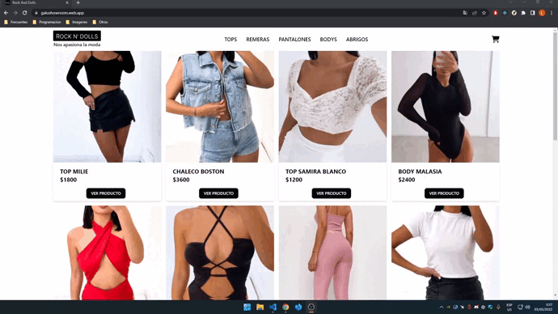

# Rock And Dolls - React Ecommerce

Projecto hecho para el curso de react js en Coder House.

## Demo



## FEATURES​

### Mostrar un catalogo de productos

### Permitir separalos por categoria

### Hacer una conexion con la base de datos para traer los productos

### hacer una compra y registrarla en FireBase

### Control de stock con firebase

### Generar un numero de orden de compra

### Generar un carrito

### Eliminar items de un carrito

### Vaciar carrito

### Calcular total​

## Correr el proyecto localmente

### Clonar el proyecto

```bash
  git clone https://github.com/LukaLiuzzi/rockanddolls-react
```

Ir al repositorio

```bash
  cd rockanddolls-react
```

Instalar dependencias

```bash
  npm install
```

Iniciar el servidor de desarrollo

```bash
  npm run start
```

## Author

- [@lukaliuzzi](https://www.github.com/lukaliuzzi)
